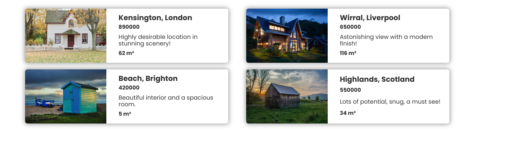
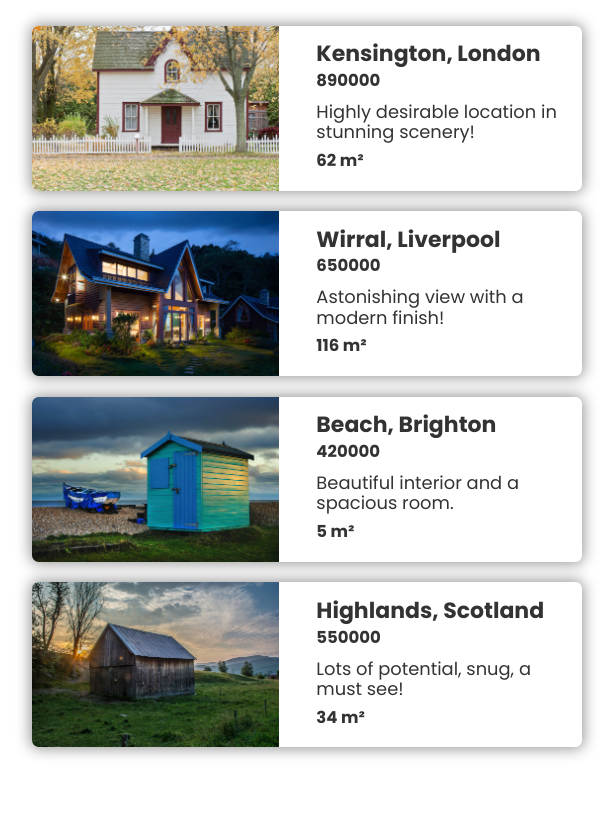
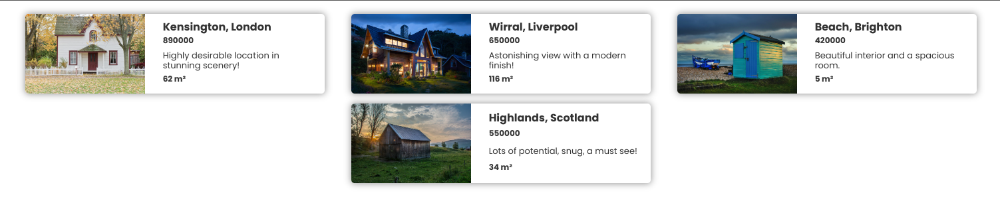
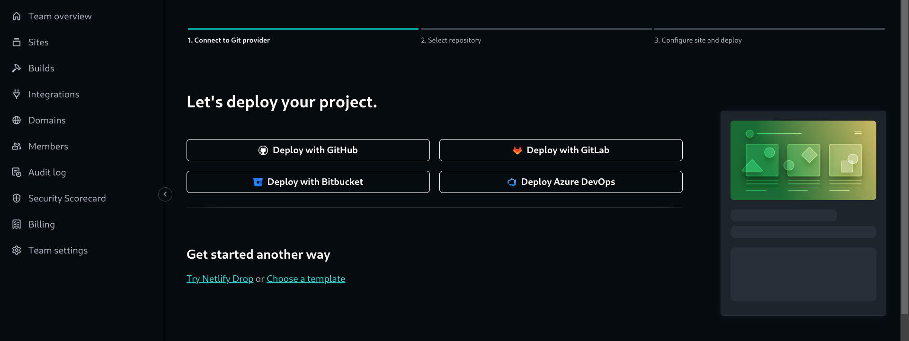
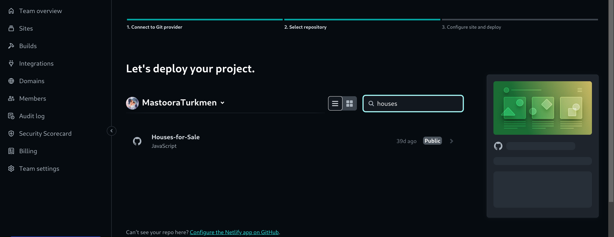
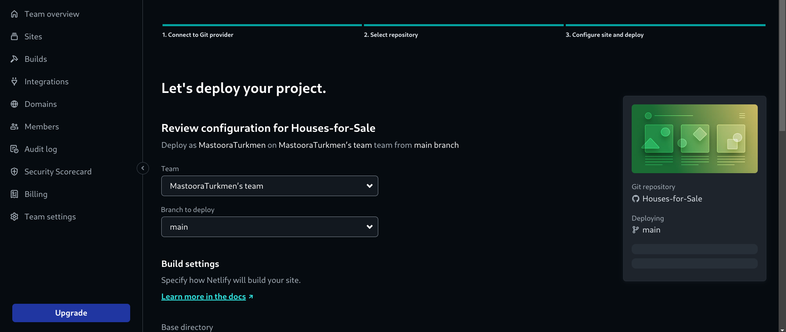
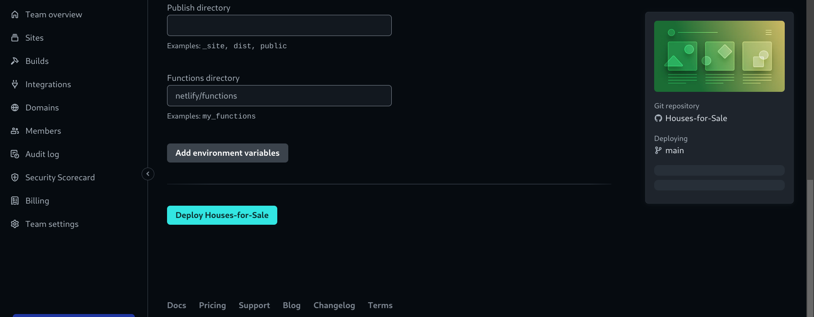
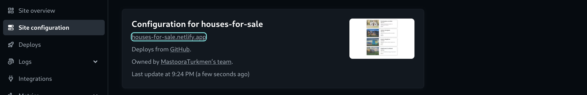

# Houses for Sale Poject 🏠🏘

Hello there,

This is a simple House Project. In this project I used following methodes:

- import/export
- .map()
- .join()
- Object destructuring
- .reduce()
- Default parameters


## Screenshots 📸






------


## Cloning the project 🪛🔨

```
# Clone this repository
$ git clone https://github.com/MastooraTurkmen/Houses-for-Sale.git

# Go inside the repository
$ cd Houses-for-Sale
```

------

## Languages and Tools are used 🗣️🔧

1. **Languages** 🗣️

    + [HTML](https://github.com/topics/html)
    + [HTML5](https://github.com/topics/html5)
    + [CSS](https://github.com/topics/css)
    + [CSS3](https://github.com/topics/css3)
    + [JavaScript](https://github.com/topics/javascript)

2. **Tools** 🔧

    + [Chrome](https://github.com/topics/chrome)
    + [Figma](https://github.com/topics/figma)
    + [VSCode](https://github.com/topics/vscode)
    + [Netlify](https://github.com/topics/netlify)


------

## Deployment 📥

1. How to deploy our project to the ***Netlify*** site?
2. I use [Netlify App](https://app.netlify.com/) for deploying my projects.
3. Go to the Netlify site and select Add a new site.
4. From there select **_Deploy with Github_**.
   
5. Then write your project name and select it.
   
6. After selecting here you can see that the project **_Review configuration for Houses-for-Sale_** and then select the **_Deploy Houses-for-Sale_** Button.
   
   
7. Now your project is Live.
   


-------

## Author 👩🏻‍💻

**Mastoora Turkmen**

[LinkedIn](https://www.linkedin.com/in/mastoora-turkmen/) 
<br>
[Github](https://github.com/MastooraTurkmen/) 
<br>
[Twitter](https://twitter.com/MastooraJ22)


------

# Codes are used

1. ***Index HTML***
2. ***Index CSS***
3. ***Index JS***


## ***Index HTML***

```html
<!doctype html>
<html>
<head>
    <link rel="stylesheet" href="https://cdnjs.cloudflare.com/ajax/libs/normalize/8.0.1/normalize.css">
    <meta name="viewport" content="width=device-width, initial-scale=1.0">
    <link rel="stylesheet" href="index.css">
    <link rel="preconnect" href="https://fonts.googleapis.com">
    <link rel="preconnect" href="https://fonts.gstatic.com" crossorigin>
    <link href="https://fonts.googleapis.com/css2?family=Poppins:wght@400;700&display=swap" rel="stylesheet">
    <title>Houses for Sale</title>
</head>
<body>
    <section class="container" id="container"></section>
    <script src="index.js" type="module"></script>
</body>
</html>
```

## ***Index CSS***

```css
body {
    margin: 0;
    color: #333;
    font-family: 'Poppins';
}

.container {
    display: flex;
    flex-wrap: wrap;
    justify-content: center;
    padding: 20px;
}

.card {
    display: flex;
    min-width: 400px;
    max-width: 450px;
    box-shadow: 0px 0px 10px 1px #999;
    margin: 0 20px 15px 20px;
    border-radius: 5px;
    max-height: 120px;
}

.card img {
   border-top-left-radius: 5px;
   border-bottom-left-radius: 5px;
   height: 100%;
}

.card-right {
    display: flex;
    flex-direction: column;
    justify-content: space-around;
    margin-left: 16px;
    padding: 11px;
}

h2{  
    font-size: 16px;
    margin: 0 0 3px 0;
}

h3{  
    font-size: 12px;
    margin: 0 0 3px 0;
}

p {
    font-size: 13px;
    margin: 5px 0 5px 0;
}
```


## ***Index JS***

```js

import {propertyForSaleArr} from "./properties/propertyForSaleArr.js"
import {placeholderPropertyObj} from "./properties/placeholderPropertyObj.js"

function getPropertyHtml(properties = [placeholderPropertyObj]) {
   return properties.map(sale => {
     const totalRome = sale.roomsM2.reduce((total, current) => total + current)
     return sale = `
            <section class="card">
            
            <div class="card-right">
                <h2>${sale.propertyLocation}</h2>
                <h3>${sale.priceGBP}</h3>
                <p>${sale.comment}</p>
                <h3>${totalRome} m&sup2</h3>
            </div>
        </section> `
    }).join('')
}

document.getElementById('container').innerHTML = getPropertyHtml(propertyForSaleArr)
```